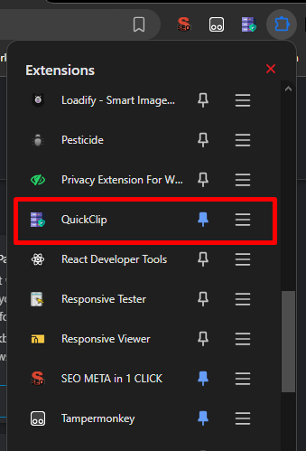

# QuickClip

QuickClip is a Chrome extension that helps you store and quickly copy frequently used links and text snippets. It also supports templates with placeholders that you can fill in when needed.

## Features

- Store and organize text snippets and links
- Create templates with placeholders
- Copy content to clipboard with a single click
- Fill in templates interactively
- Import and export your data
- Simple and intuitive user interface

## Installation Guide

Follow these steps to install QuickClip in developer mode:

### Step 1: Clone the Repository

```bash
git clone https://github.com/shubhamc1947/QuickClip-Extension
cd QuickClip-Extension
```

### Step 2: Load the Extension in Chrome

1. Open Chrome and navigate to `chrome://extensions/`
2. Enable "Developer mode" by toggling the switch in the top-right corner
3. Click on "Load unpacked"
4. Select the directory where you cloned the QuickClip repository
5. The extension should now appear in your extensions list



### Step 3: Access QuickClip

1. Click on the QuickClip icon in your Chrome toolbar
2. If you don't see the icon, click the puzzle piece icon to see all extensions and pin QuickClip

## How to Use

### Adding a New Item

1. Click the QuickClip icon in your toolbar
2. Click the "Add New" button
3. Fill in:
   - **Title**: A name for your snippet
   - **Type**: Choose between "Plain Text/Link" or "Template with Placeholders"
   - **Content**: The text you want to store
4. Click "Save"

### Using Templates

1. For templates, choose "Template with Placeholders" as the type
2. In the content field, use curly braces to define placeholders: `{PLACEHOLDER_NAME}`
3. Example: `Hello {NAME}, thank you for your interest in {POSITION}.`
4. When you click the copy button for a template, you'll be prompted to fill in the placeholders before copying

### Copying Items

1. Click the copy icon (clipboard) next to any item
2. For regular items, the content will be copied directly to your clipboard
3. For templates, you'll first fill in the placeholders, then the completed text will be copied

### Editing and Deleting Items

- To edit an item, click the pencil icon
- To delete an item, click the trash icon

### Import/Export Data

1. Click the "Import/Export" button
2. To back up your data, click "Export Data"
3. To restore from a backup, click "Import Data" and select your backup file

## Project Structure

- `manifest.json`: Extension configuration
- `popup.html`: The main UI
- `popup.css`: Styles for the popup
- `popup.js`: JavaScript functionality
- `icons/`: Directory containing extension icons

## Browser Compatibility

QuickClip is designed for Chrome and Chromium-based browsers that support Manifest V3.

## License

[MIT License](LICENSE)

## Contributing

Contributions are welcome! Please feel free to submit a Pull Request.

---

If you encounter any issues or have suggestions for improvement, please open an issue in the repository.
